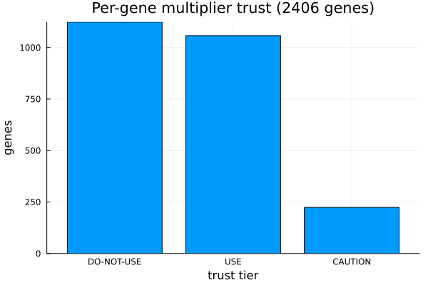

# Which genes to trust

Not every fitted multiplier is equally reliable. The package ships a per-gene confidence table
(`data/multiplier_confidence.csv`) scoring each substrate on bootstrap robustness, source agreement,
transfer correlation and periodicity, and sorting them into trust tiers:

Filter to the genes you should act on with the `tier` / `apply_multiplier` columns; fall back to the
recommended default for the rest.
