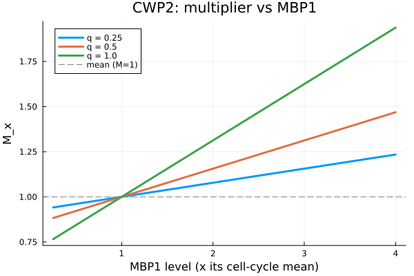

# Tutorial — the multiplier, interactively

For a gene ``x``, the cell-cycle multiplier rescales its transcription rate **without
changing the average**:

```math
M_x(t) = 1 + q_x\,\frac{\sum_i \alpha_i\left(\mathrm{TF}_i(t)/\overline{\mathrm{TF}_i} - 1\right)}{\sum_i |\alpha_i|}.
```

The figure below sweeps the strongest regulator of `CWP2` from a quarter to four times its
cell-cycle mean, for three values of the weight ``q_x``. The curve always crosses ``M_x = 1``
at the mean (dashed line) — the mean-preserving guarantee — and ``q_x`` scales the amplitude.



## Run it interactively

The figure above is one slice. The full [Pluto](https://plutojl.org) notebook lets you pick any
of the **1,027** fitted genes, choose which regulator to sweep, and drag ``q_x`` live:

- **Notebook:** [`notebook/multiplier_explorer.jl`](https://github.com/djsegal/TranscriptionMultiplier.jl/blob/main/notebook/multiplier_explorer.jl)
- **Run it:** install [Pluto](https://plutojl.org) (`import Pkg; Pkg.add("Pluto")`), then
  `using Pluto; Pluto.run()` and open the notebook file.

The reported numbers are reproduced by the package's test suite (`runtests.jl`): ``M_x = 1`` at the
mean to machine precision, for any mix of activators and repressors and any ``q_x``.
